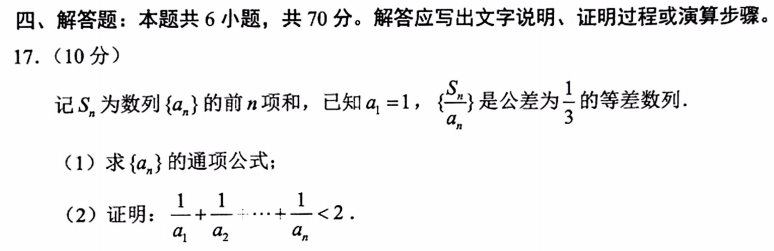

听说今年的高考数学题很难，今天有空看了几题，以17题练个手。廉颇老矣，尚能饭否？！

<!--more-->

## (1)

$$
\begin{aligned}
C_n &= \frac{S_n}{a_n} \\
C_1 &= \frac{a_1}{a_1} = 1 \\
C_n &= 1+(n-1) \frac{1}{3} = \frac{n+2}{3} \\
S_n &= \frac{n+2}{3} a_n \\
S_{n-1} &= \frac{n+1}{3} a_{n-1} \\
S_n - S_{n-1} &= \frac{n+2}{3} a_n - \frac{n+1}{3}  a_{n-1} \\
a_n &=  \frac{n+2}{3}  a_n - \frac{n+1}{3}  a_{n-1} \\
3a_n &= (n+2)a_n - (n+1)a_{n-1} \\
(n-1)a_{n} &= (n+1)a_{n-1} \\
\frac{a_{n}}{a_{n-1}} &= \frac{n+1}{n-1} \\
\frac{a_{n-1}}{a_{n-2}} &= \frac{n}{n-2} \\
\dots \\
\frac{a_{2}}{a_{1}} &= \frac{3}{1} \\

\frac{a_{n}}{a_{n-1}} \cdot \frac{a_{n-1}}{a_{n-2}} \cdot \frac{a_{2}}{a_{1}} &= \frac{n+1}{n-1} \cdot \frac{n}{n-2} \cdots \frac{3}{1} \\
a_n &= \frac{\frac{(n+1)!}{n!}}{\frac{2}{n}} \\
&= \frac{n(n+1)}{2}

\end{aligned}
$$

## (2)

$$
\begin{aligned}
\frac{1}{a_n} &= \frac{2}{n(n+1)} \\
&= 2(\frac{1}{n} - \frac{1}{n+1}) \\

\frac{1}{a_1} + \cdots + \frac{1}{a_n} &= 2(1-\frac{1}{2} + \frac{1}{2}-\frac{1}{3} + \cdots + \frac{1}{n} - \frac{1}{n+1}) < 2
 
\end{aligned}
$$