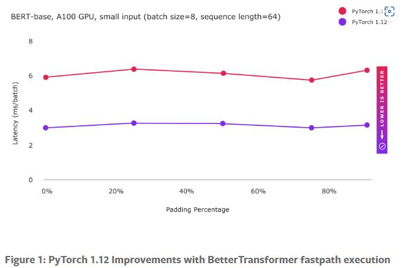
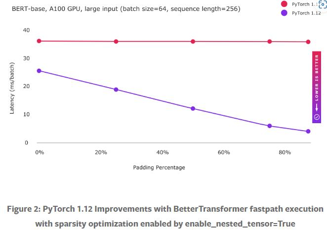

PyTorch 1.12版本对 `torch.nn.TransformerEncoder` 进行了专项优化，用户无须调整模型结构即可大幅提升Transformer推理性能。具体介绍如下：

<!--more-->

## 性能提升
BetterTransformer在CPU和GPU上都能获得加速，官方主要实现了两种优化：
- 混合内核并结合多个独立算子来更高效地实现Transformer
- 利用输入的稀疏性来避免在padding上的冗余运算

## 向后兼容
用户无须调整之前PyTorch版本的代码，安装新的1.12版本即可。

## 使用条件
- 模型使用了 `TransformerEncoder`、`TransformerEncoderLayer`、 `MultiheadAttention` 模块
- 必须在推理场景下：
  - `model.eval()`
  - ` torch.no_grad`
- 为了对输入稀疏性优化，在实例化 `TransformerEncoder` 并传入 `src_key_padding_mask` 的时候，设置 `enable_nested_tensor`

### 加速效果

该实验加速受益于算子优化。

随着数据量的加大，算子优化提升有限，此时开启稀疏优化可以极大提升模型性能。

### 最佳实践
[FAST TRANSFORMER INFERENCE WITH BETTER TRANSFORMER](https://pytorch.org/tutorials/beginner/bettertransformer_tutorial.html)

## 未来工作
- 将推理优化扩展到训练优化
- 将编码器优化扩展到解码器优化
- 将BetterTransformer应用到FairSeq、HuggingFace等库

___

## 参考
- [A BetterTransformer for Fast Transformer Inference](https://pytorch.org/blog/a-better-transformer-for-fast-transformer-encoder-inference//)