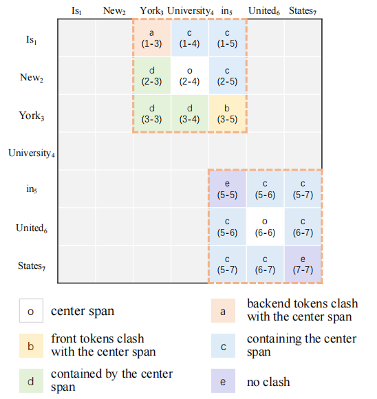
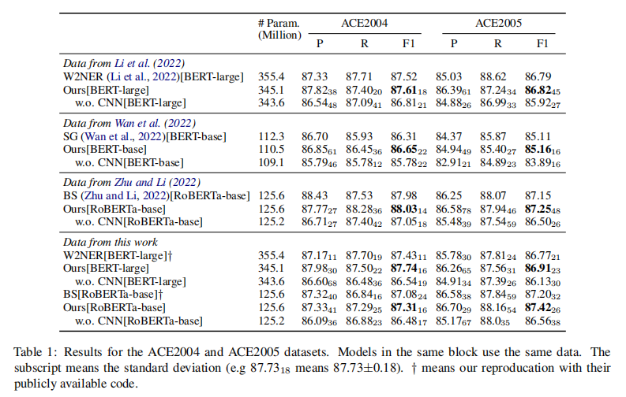
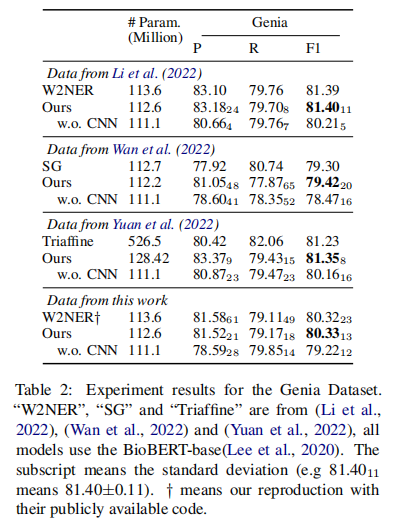

现有片段分类方法采用Biaffine Decoder得到一个评分矩阵 $n \times n \times T$ ，$n$ 表示序列长度，$T$ 表示实体类别数量。本文沿用了片段分类的方法，但作者发现评分矩阵的临近片段具有非常明显的空间关联，如下图所示：

<!--more-->

作者将评分矩阵抽象成了一张图像，维度为 $n \times n \times r$ ，$r$ 相当于通道数。然后利用CNN来建模空间依赖关系。该方法十分简单有效，在三个数据集上都略胜sota一筹：

___

## 参考

- [​复旦大学邱锡鹏组：CNN-NER——极其简单有效的嵌套命名实体识别方法](https://mp.weixin.qq.com/s/z8CgjK57nN4bFlKa-UUQWg)
- [An Embarrassingly Easy but Strong Baseline for Nested Named Entity Recognition](https://arxiv.org/abs/2208.04534)
- [yhcc/CNN_Nested_NER](https://github.com/yhcc/CNN_Nested_NER)