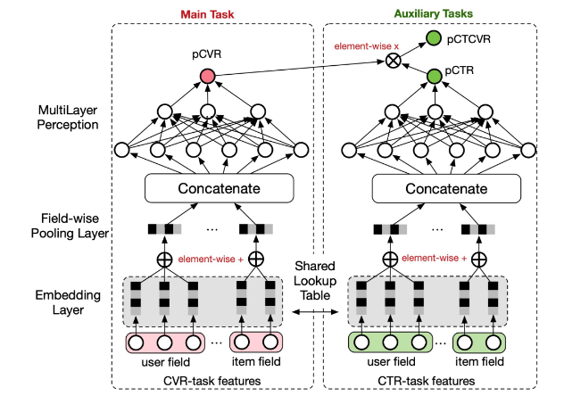
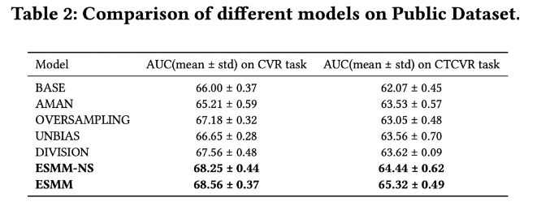
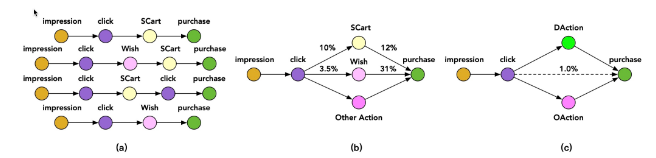
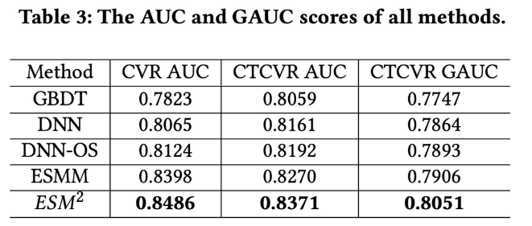
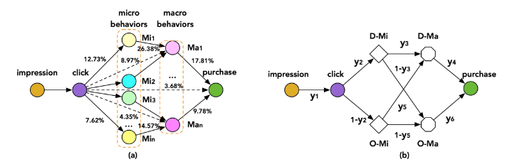
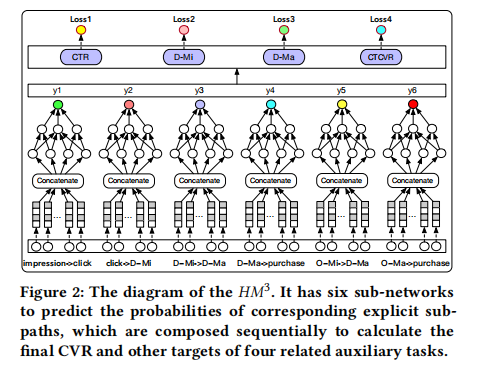
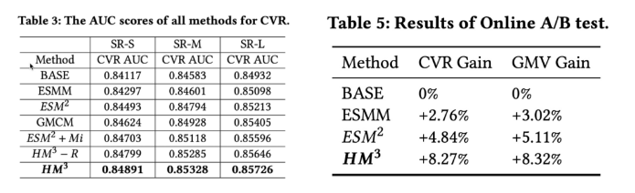

介绍一下阿里巴巴在CVR领域多任务学习的三篇论文：

<!--more-->

## ESMM

经典之作，不解释了。公式如下：

$$
\underbrace{p(y=1, z=1 \mid \boldsymbol{x})}_{p C T C V R}=\underbrace{p(y=1 \mid \boldsymbol{x})}_{p C T R} \times \underbrace{p(z=1 \mid y=1, \boldsymbol{x})}_{p C V R}
$$

## ESM2

用户点击商品后，除了直接购买外，还会有加入购物车等行为，这些对产生转化也有决定性的影响。因此建模这些行为序列也是多任务学习的重要方向。

## HM3

该工作认为ESM2中引入的用户行为是宏观行为。在这些宏观行为之外，还可以观察到很多微观行为（比如在点击商品后，查看商品大图、查看评论、咨询客服等等），这些微观行为也可以辅助进行cvr预估。

___

## 转载
- [CVR预估中的多任务学习三部曲](https://mp.weixin.qq.com/s/RqZzwwJNF1b2Rad1PAtbAA)