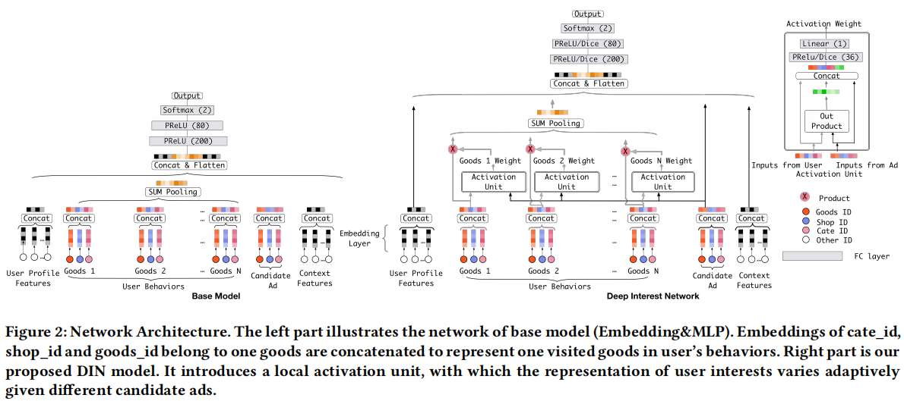
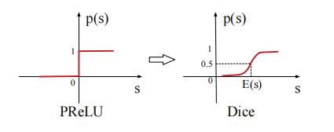

传统的Embedding&MLP架构将用户特征编码进一个固定长度的向量。当推出一个商品时，该架构无法捕捉用户丰富的历史行为中的多样性兴趣与该商品的关联。阿里妈妈团队提出了DIN网络进行改进，主要有如下两点创新：

<!--more-->

- 引入注意力机制来捕捉历史行为与当前商品的关联。用NMT的话来说，上文不同的单词对当前待生成的单词贡献不同，贡献高的应该赋予更大的权重，否则赋小
- 设计两种训练技巧来帮助训练大规模稀疏神经网络：
  - mini-batch aware正则化
  - 自适应激活函数

## 网络结构

#### 注意力机制

$$
\boldsymbol{v}_U(A)=f\left(\boldsymbol{v}_A, \boldsymbol{e}_1, \boldsymbol{e}_2, \ldots, \boldsymbol{e}_H\right)=\sum_{j=1}^H a\left(\boldsymbol{e}_j, \boldsymbol{v}_A\right) \boldsymbol{e}_j=\sum_{j=1}^H \boldsymbol{w}_j \boldsymbol{e}_j
$$
需要注意的是，DIN舍弃了 $\sum_{i}w_i = 1$ 这个限制。主要是为了突出用户对历史兴趣的强烈程度，比如用户对电子产品很感兴趣，那么他这类兴趣的得分就很高，其它兴趣得分则很小，兴趣差异得到放大。

#### 两种训练技巧

- mini-batch aware正则化：L2正则化是对模型所有的参数进行约束，训练成本高，而工业界推荐系统常常是大规模的稀疏网络。DIN团队对L2正则进行了近似计算，这样就能降低训练成本：
$$
L_2(\mathbf{W}) \approx \sum_{j=1}^K \sum_{m=1}^B \frac{\alpha_{m j}}{n_j}\left\|\boldsymbol{w}_j\right\|_2^2 
$$

- 自适应激活函数

