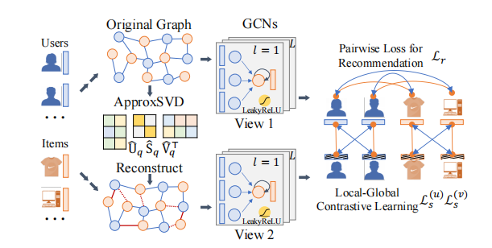

传统的基于图的对比学习范式容易丢失结构信息，LightGCL通过SVD分解邻接矩阵构造了正样本图，并最大程度保留了原图全局结构信息：

<!--more-->

## 参考
- [ICLR'23 UnderReview | LightGCL: 简单而有效的图对比学习推荐系统](https://zhuanlan.zhihu.com/p/576480565)
- [奇异值分解(SVD)原理与在降维中的应用](https://www.cnblogs.com/pinard/p/6251584.html)