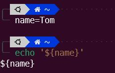
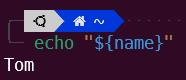
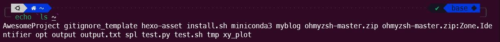

Linux的引号分为单引号、双引号、反引号三种。

<!--more-->

## 单引号
被单引号包括的字符串被看作是普通字符串，不会对特殊字符进行转义：

## 双引号
被双引号包括的字符会进行转义：

## 反引号
如果需要执行是shell命令的字符串，则使用反引号：

___

## 参考
- [Shell（Bash）单引号、双引号和反引号用法详解](http://c.biancheng.net/view/951.html)