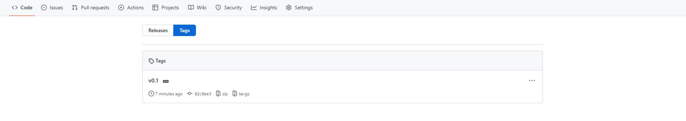

## 创建tag
```bash
git tag <tagname> -m <message> <commit-id>
```
- tagname：一般为版本号，比如v1.0
- message（可选）：具体描述，类似于 `git commit -m <message>`
- commit-id（可选）：默认为当前commit

<!--more-->

## 列出tag
```bash
git tag
```

## 显示某tag详细信息
```bash
git show <tagname>
```

## 推送tag到远程
```bash
git push origin <tagname>
# git push origin --tags # 推送本地所有的tag
```


## 删除tag
1. 删除本地tag：`git tag -d <tagname>`
2. 更新远程仓库的tag：`git push origin :refs/tags/<tagname>`

___

## 参考
- [Git的Tag使用](https://www.jianshu.com/p/a07777d0b018)