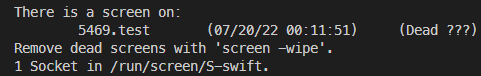

`screen` 是一款Linux自带的多重视窗管理工具，功能稍微比[tmux](https://transformerswsz.github.io/2019/09/12/tmux%20-%20%E7%BB%88%E7%AB%AF%E5%A4%8D%E7%94%A8%E5%B7%A5%E5%85%B7/)弱些。由于公司服务器上没有管理员权限，无法安装tmux，所以只能使用该命令了。在此记录下基本使用方法。

<!--more-->

## 最佳实践
### 新建窗口
```bash
screen -S test
```

### 离开当前会话窗口
```bash
screen -d test
```
也可以使用快捷键，先按 `ctrl + a` ，再按 `d` 。

### 列出所有的会话窗口
```bash
screen -ls
```


### 重新进入会话
```bash
screen -r test
```

### 杀死会话窗口
1. 杀死进程：`kill -9 5469`
2. 清除缓存：`screen -wipe`
___
## 参考

- [linux screen 命令详解](https://www.cnblogs.com/mchina/archive/2013/01/30/2880680.html)