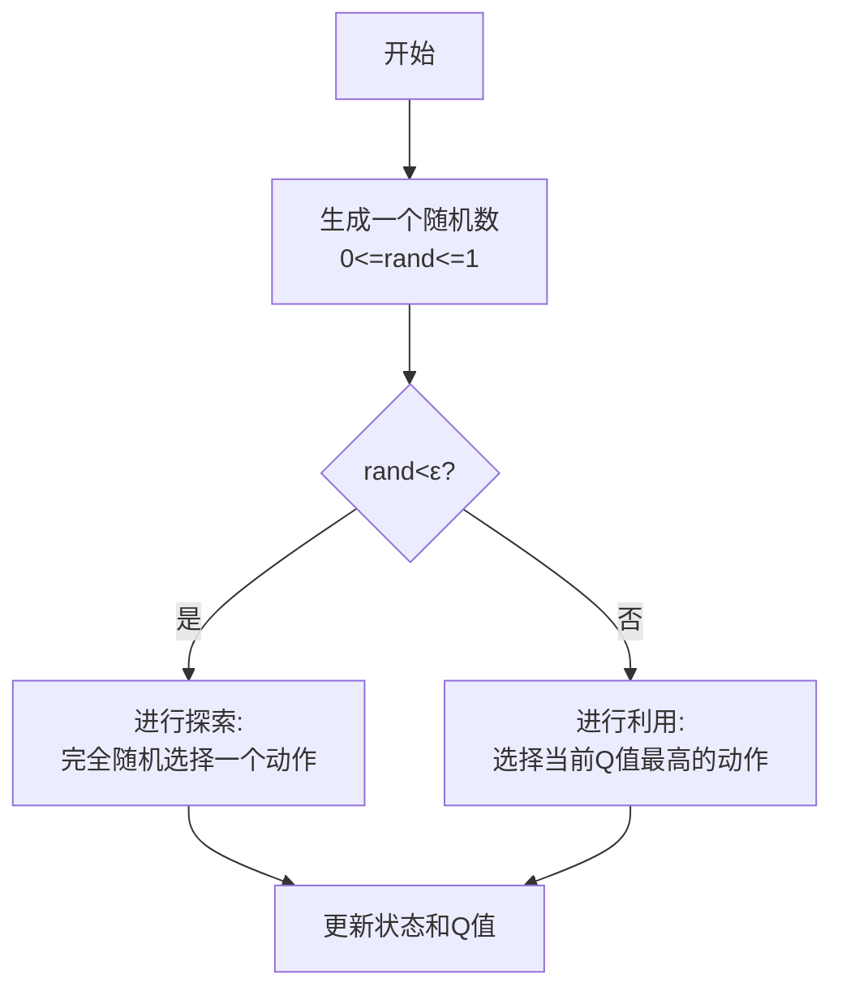

**ε-greedy（Epsilon-Greedy）** 是强化学习中最重要、最基础的概念之一，它完美地解决了**探索（Exploration）** 与**利用（Exploitation）** 之间的权衡问题。

<!--more-->


 
该行为策略的流程如下：


- 在需要选择动作时，智能体Agent以 **1 - ε** 的概率选择**当前认为最好的动作**（利用）。
- 以 **ε** 的概率**完全随机选择一个动作**（探索）。


### ε-greedy的优势

1.  避免局部最优（Local Optimum）：
    - 如果一开始就锁定某个看似不错的动作，可能会错过真正全局最优（Global Optimum）的动作。随机探索提供了跳出局部最优的可能性。
    - 示例：一个机器人面前有两个按钮，按左按钮每次给1块钱，按右按钮有10%的概率给100块钱。如果一开始按左按钮得了一次钱，它就认为左按钮好，再也不按右按钮，从而错过了获得100块的机会。

2.  动态环境适应：
    - 环境可能发生变化，之前最好的动作可能不再是最优。持续的探索能帮助智能体发现这些变化并及时调整策略。

### ε 值的选择与衰减

- ε 的选择：
  - ε 太大（如 0.5）：探索过于频繁，智能体像个无头苍蝇，学不到知识，策略收敛慢。
  - ε 太小（如 0.01）：探索不足，容易过早陷入局部最优，无法发现更好的策略。
  - 常用值：`0.1` 是一个很好的起点。

- ε 的衰减（Decay）：
  - 在训练初期，智能体对环境一无所知，需要**大量探索**，因此 ε 可以设置得高一些。
  - 随着训练进行，智能体越来越有经验，Q表越来越准，就应该**逐渐减少探索，增加利用**，收敛到最优策略。
  - 实现方法：`ε = max(ε_min, ε * decay_rate)` 或 `ε = 0.1 * (0.99)^episode`

### ε-greedy代码示例

```python
# 初始化参数
EPSILON_START = 1.0     # 初始探索概率 (100% 探索)
EPSILON_END = 0.01      # 最小探索概率 (1% 探索)
EPSILON_DECAY = 0.995    # 衰减率 (每轮乘以0.995)
current_epsilon = EPSILON_START

# 训练循环
for episode in range(TOTAL_EPISODES):
    state = env.reset()  # 重置环境，获取初始状态
    
    while not done:
        # ε-greedy 动作选择 (支持衰减)
        if random() < current_epsilon:
            action = random_choice(ACTIONS)  # 随机探索
        else:
            action = argmax(q_table[state])  # 选择当前最优动作
        
        # 执行动作，获取新状态和奖励
        next_state, reward, done = env.step(action)
        
        # Q-Learning 更新
        q_table[state][action] += ALPHA * (reward + GAMMA * max(q_table[next_state]) - q_table[state][action])
        
        state = next_state  # 更新状态
    
    # ε 衰减 (指数衰减)
    current_epsilon = max(EPSILON_END, current_epsilon * EPSILON_DECAY)
    # 线性衰减
    # current_epsilon = max(EPSILON_END, EPSILON_START - episode * (EPSILON_START - EPSILON_END) / TOTAL_EPISODES)
    
    # 可选：打印当前ε值
    if episode % 100 == 0:
        print(f"Episode: {episode}, Current ε: {current_epsilon:.4f}")
```